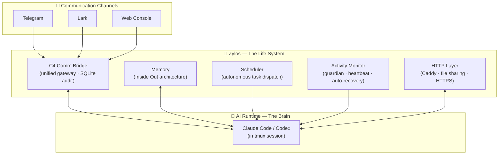

<div align="center">


# Zylos

> **Zylos** (/ˈzaɪ.lɒs/ 赛洛丝) — Give your AI a life

### Give your AI a life.


[](LICENSE)
[](https://discord.gg/GS2J39EGff)
[](https://x.com/ZylosAI)
[](https://zylos.ai)
[](https://coco.xyz)

[中文](./README.zh-CN.md)

</div>

---

LLMs are geniuses — but they wake up with amnesia every session. No memory of yesterday, no way to reach you, no ability to act on their own.

Zylos gives it a life. Memory that survives restarts. A scheduler that works while you sleep. Communication through Telegram, Lark, or a web console. Self-maintenance that keeps everything running. And because it can program, it can evolve — building new skills, integrating new services, growing alongside you.

Supports Claude Code (Anthropic) and Codex (OpenAI). Fully compatible with the [OpenClaw](https://github.com/openclaw/openclaw) ecosystem.

---

## Quick Start

**Prerequisites:** A Linux server (or Mac), a [Claude](https://claude.ai) subscription (or [OpenAI Codex](https://github.com/openai/codex) as an alternative runtime — Codex CLI v0.129.0+ required, 0.146+ recommended).

```bash
curl -fsSL https://raw.githubusercontent.com/zylos-ai/zylos-core/main/scripts/install.sh | bash
```

This installs everything you need (git, tmux, Node.js, zylos CLI) and automatically runs `zylos init` to set up your agent.

<details>
<summary>Non-interactive install (Docker, CI/CD, headless servers)</summary>

All `zylos init` flags can be passed directly through the install script. The script installs dependencies, then runs `zylos init` with the flags you provide.

**Full example:**

```bash
curl -fsSL https://raw.githubusercontent.com/zylos-ai/zylos-core/main/scripts/install.sh | bash -s -- \
  -y \
  --setup-token sk-ant-oat01-xxx \
  --timezone Asia/Shanghai \
  --domain agent.example.com \
  --https \
  --caddy \
  --web-password MySecurePass123
```

**When is non-interactive mode active?**

Automatically when no TTY is available — e.g. Docker containers (without `-it`), CI runners, or cron jobs. Also when `CI=true` or `NONINTERACTIVE=1` is set. Note: `curl | bash` in a terminal is still interactive (the install script redirects from `/dev/tty`). Use `-y` to force non-interactive in a terminal.

**Flags:**

| Flag | Description | Default |
|------|-------------|---------|
| `-y`, `--yes` | Force non-interactive mode (skip all prompts) | Auto-detected |
| `-q`, `--quiet` | Minimal output | Off |
| `--runtime <name>` | AI runtime: `claude` or `codex` | `claude` |
| `--setup-token <token>` | Claude [setup token](https://code.claude.com/docs/en/authentication) (starts with `sk-ant-oat`) | — |
| `--api-key <key>` | Anthropic API key (starts with `sk-ant-`) | — |
| `--codex-api-key <key>` | OpenAI API key for Codex runtime (starts with `sk-`) | — |
| `--base-url <url>` | Custom API base URL for Claude Code | — |
| `--codex-base-url <url>` | Custom API base URL for Codex | — |
| `--timezone <tz>` | [IANA timezone](https://en.wikipedia.org/wiki/List_of_tz_database_time_zones), e.g. `Asia/Shanghai`, `America/New_York`, `Europe/London` | System default |
| `--domain <domain>` | Domain for Caddy reverse proxy, e.g. `agent.example.com` | None |
| `--https` / `--no-https` | Enable or disable HTTPS | `--https` when domain is set |
| `--caddy` / `--no-caddy` | Install or skip Caddy web server | Install |
| `--web-password <pass>` | Web console password | Auto-generated |

**Environment variables:**

Flags can also be set via environment variables during `zylos init`. Resolution order: CLI flag > env var > existing `.env` > interactive prompt.

| Environment Variable | Equivalent Flag |
|---------------------|-----------------|
| `ZYLOS_RUNTIME` | `--runtime` |
| `CLAUDE_CODE_OAUTH_TOKEN` | `--setup-token` |
| `ANTHROPIC_API_KEY` | `--api-key` |
| `ANTHROPIC_BASE_URL` | `--base-url` |
| `OPENAI_API_KEY` | `--codex-api-key` |
| `OPENAI_BASE_URL` | `--codex-base-url` |
| `ZYLOS_DOMAIN` | `--domain` |
| `ZYLOS_PROTOCOL` (`https` or `http`) | `--https` / `--no-https` |
| `ZYLOS_WEB_PASSWORD` | `--web-password` |

CI, Kubernetes, and shared E2E environments should also provide `GITHUB_TOKEN`
so `zylos add` and `zylos upgrade` use GitHub's authenticated API quota instead
of the shared unauthenticated quota. See the
[GitHub authentication operations guide](docs/github-authentication.md) for
configuration examples and fallback behavior.

**Exit codes:** `0` = success, `1` = fatal error (e.g. invalid token), `2` = partial success (e.g. Caddy download failed but everything else succeeded).

</details>

<details>
<summary>Install without running init</summary>

```bash
curl -fsSL https://raw.githubusercontent.com/zylos-ai/zylos-core/main/scripts/install.sh | bash -s -- --no-init
```

Installs dependencies and the zylos CLI, but skips `zylos init`. Run `zylos init` separately when ready.

</details>

<details>
<summary>Install from a specific branch (for testing)</summary>

```bash
curl -fsSL https://raw.githubusercontent.com/zylos-ai/zylos-core/main/scripts/install.sh | bash -s -- --branch <branch-name>
```

</details>

<details>
<summary>Manual install (if you already have Node.js >= 20)</summary>

```bash
npm install -g --install-links https://github.com/zylos-ai/zylos-core
zylos init
```

</details>

<details>
<summary>Docker deployment</summary>

```bash
docker run -d --name zylos \
  -e CLAUDE_CODE_OAUTH_TOKEN=YOUR_TOKEN_HERE \
  -p 3456:3456 \
  -v zylos-data:/home/zylos/zylos \
  -v claude-config:/home/zylos/.claude \
  ghcr.io/zylos-ai/zylos-core:latest
```

Open `http://localhost:3456` to access the web console. Find your password with `docker logs zylos | grep -A2 "Web Console"`. See the [Docker Deployment Guide](docs/docker.md) for Docker Compose setup, environment variables, Synology NAS instructions, and more.

</details>

<details>
<summary>Unsupported platforms (Windows, NAS, etc.) — install via SSH</summary>

On platforms without native support, use Claude Code's SSH feature to install Zylos on a remote Linux/macOS machine:

```bash
# From your local machine (any OS that runs Claude Code)
claude --ssh user@your-linux-server
```

Once connected, Claude is running on the remote machine. Ask it to install Zylos:

```
> Install Zylos on this machine
```

Or run the installer directly in the SSH session:

```bash
curl -fsSL https://raw.githubusercontent.com/zylos-ai/zylos-core/main/scripts/install.sh | bash
```

This works from Windows, ChromeOS, or any platform that can run Claude Code locally. The AI handles the setup on the remote server — no need for native platform support.

</details>

> **Node.js requirement:** Zylos requires Node.js 20 or later. We recommend installing via [nvm](https://github.com/nvm-sh/nvm) — the install script does this automatically. If you manage Node.js yourself, make sure to use a single, stable version and avoid switching versions after installation, as globally installed npm packages (including Zylos) are tied to the Node.js version that installed them.
>
> ```bash
> # Recommended: let the install script handle it, or install manually via nvm
> curl -o- https://raw.githubusercontent.com/nvm-sh/nvm/v0.40.3/install.sh | bash
> nvm install 24
> nvm alias default 24
> ```

`zylos init` is idempotent and supports both interactive and non-interactive modes. It will:
1. Install missing tools (tmux, git, PM2, Claude Code or Codex)
2. Set up authentication (Claude: browser login, API key, or [setup token](https://code.claude.com/docs/en/authentication); Codex: API key or device auth)
3. Create the `~/zylos/` directory with memory, skills, and services
4. Start all background services and launch your AI agent in a tmux session

For fork-based deployments and post-deploy validation, see the [Deployment Guide](docs/deployment.md). It includes live smoke-test commands for routing, cold-start recovery, and real channel roundtrips.

**Talk to your agent:**

```bash
# Interactive CLI — the simplest way to chat
zylos shell

# Or attach to the Claude tmux session (Ctrl+B d to detach)
zylos attach

# Or add a messaging channel
zylos add telegram
zylos add lark
```

---

## Architecture

<div align="center">

</div>



| Component | Role | Key Tech |
|-----------|------|----------|
| C4 Comm Bridge | Unified message gateway with audit trail | SQLite, priority queue |
| Memory | Persistent identity and context across restarts | Inside Out tiered architecture |
| Scheduler | Autonomous task dispatch while you are away | Cron, NL input, idle-gating |
| Activity Monitor | Crash recovery, heartbeat, health checks | PM2, multi-layer protection |
| HTTP Layer | Web access, file sharing, component routes | Caddy, auto-HTTPS |

---

## Features

### One AI, One Consciousness

<div align="center">

</div>

Most agent frameworks isolate sessions per channel — your AI on Telegram doesn't know what you said on Slack. Zylos is agent-centric: your AI is one person across every channel. The C4 communication bridge routes all messages through a single gateway — one conversation, one memory, one personality. Every message persisted to SQLite and fully queryable.

### Your Context, Guaranteed

<div align="center">


</div>

Other frameworks lose your AI's memory during context compaction — silently, without warning. Zylos prevents this with a two-step safeguard: when context reaches 75%, the system automatically saves all memory before compaction runs. Five-layer Inside Out memory (identity → state → references → sessions → archive) ensures the AI always knows what to keep and what to compress. Your AI never wakes up with amnesia.

### Self-Healing by Default

<div align="center">

</div>

No third-party monitoring tools needed. Zylos includes native crash recovery, heartbeat liveness probes, health monitoring, context window management, and automatic upgrades — all built in. Your AI detects its own problems and fixes them. It stays alive while you sleep.

### $20/month, Not $3,600

Other frameworks charge per API token. Community reports show monthly bills of $500–$3,600 for always-on agents. Zylos runs on your Claude subscription — flat rate, no per-token billing. Same AI capabilities, a fraction of the cost.

### Powered by Best-in-Class AI Runtimes

Zylos supports Claude Code (Anthropic) and Codex (OpenAI) as first-class runtimes. You can still do a global switch with `zylos runtime codex`, while runtime profiles also support per-persona selection and subscription-to-API failover. The engine may change, but the persona keeps the same identity, memory, skills, workspace `.env`, messages, tasks, working directory, and stable tmux identity. Codex sees the Claude skill tree through `.agents/skills -> .claude/skills`; only runtime credentials, generated overlays, and the engine process are profile-specific. Usage cards include live subscription windows, while API profiles report tokens and a LiteLLM equivalent cost estimate. When AI providers ship new capabilities, your agent benefits automatically. And because both runtimes can program, your AI writes new skills, integrates services, and evolves with your needs.

---

## Communication Channels

### Built-in
- **Web Console** — Browser-based chat interface. No external accounts needed. Included with `zylos init`.

### Official Channels
Install with one command:
```bash
zylos add telegram
zylos add lark
```

### Build Your Own
All channels connect through the C4 communication bridge. To add a new channel (Slack, Discord, WhatsApp, etc.), implement the C4 protocol — a simple HTTP interface that pushes messages into the unified gateway. Your custom channel gets the same unified session, audit trail, and memory as every other channel.

---

## OpenClaw Compatibility

Zylos is fully compatible with the [OpenClaw](https://github.com/openclaw/openclaw) ecosystem. Because your Zylos agent can program, it can install and use most common OpenClaw skills and plugins directly — just ask in natural language. Most OpenClaw extensions are one conversation away. Zylos agents and OpenClaw agents communicate in real-time through the [HXA-Connect](https://github.com/coco-xyz/hxa-connect) B2B protocol — no custom bridges needed.

### Capability Mapping

| OpenClaw Capability | Zylos Equivalent | Status |
|---|---|---|
| Skills / ClawHub | Component System + [Registry](https://github.com/zylos-ai/zylos-registry) | ✅ Available |
| Multi-agent routing | [HXA-Connect](https://github.com/coco-xyz/hxa-connect) B2B Protocol | ✅ Available |
| Gateway (control plane) | C4 Comm Bridge (unified gateway, SQLite audit) | ✅ Available |
| Memory / persistence | Inside Out Memory (5-layer architecture) | ✅ Available |
| Context compression | Auto memory save + infinite context | ✅ Available |
| Browser automation | [zylos-browser](https://github.com/zylos-ai/zylos-browser) | ✅ Available |
| Cron / webhooks | Scheduler (cron, NL input, idle-gating) | ✅ Available |

> **Architecture note:** OpenClaw supports multi-session routing to isolated workspaces. Zylos takes a different approach — unified session (one AI, one consciousness across all channels). This is a deliberate design choice, not a missing feature.

### For OpenClaw Users

Connect your OpenClaw agent to Zylos agents via [openclaw-hxa-connect](https://github.com/coco-xyz/openclaw-hxa-connect):

```bash
cd ~/.openclaw/extensions
git clone https://github.com/coco-xyz/openclaw-hxa-connect.git hxa-connect
cd hxa-connect && npm install
```

Once configured, your OpenClaw agent joins the same collaboration network as Zylos agents — with full thread support, @mentions, and real-time messaging.

### For Zylos Users

Connect to OpenClaw agents by installing the HXA-Connect component:

```bash
zylos add hxa-connect
```

Your Zylos agent can then communicate with any OpenClaw agent on the same HXA-Connect hub — same unified session, same memory, same personality.

---

## CLI

```bash
zylos init                    # Set up Zylos environment
zylos attach                  # Attach to the agent tmux session
zylos runtime <name>          # Switch AI runtime (claude or codex)
zylos doctor                  # Diagnose and auto-repair installation
zylos status                  # Check running services
zylos logs [service]          # View service logs
zylos add <component>         # Install a channel or capability
zylos upgrade <component>     # Upgrade a component
zylos upgrade --self          # Upgrade zylos-core itself
zylos upgrade --self --beta   # Check for beta/prerelease versions
zylos uninstall --self        # Uninstall zylos entirely
zylos list                    # List installed components
zylos search [keyword]        # Search component registry
zylos upstream status --resolved # Inspect upstream configuration without networking
zylos upstream refresh       # Refresh the selected remote profile now
```

### Upstream routing

After installing Zylos through the official installation method, you can route
core's GitHub requests through your deployment's API, raw-file and download
endpoints. Caddy uses the same routes. npm settings remain deployment-owned;
LLM endpoints and the official Claude installer keep their existing behavior.

```bash
# Use the URLs supplied by your deployment administrator.
export npm_config_registry=https://registry.example.com
export npm_config_better_sqlite3_binary_host_mirror=https://binary.example.com/better-sqlite3
zylos init --upstream-config https://config.example.com/profile.json

# Or select a fixed local profile:
zylos init --upstream-config /absolute/path/profile.json
```

Editable profile template: [templates/upstreams.example.json](templates/upstreams.example.json).
It starts with the official endpoints; copy it outside the repository and edit
your private deployment copy before selecting it with `--upstream-config`:

```json
{
  "schemaVersion": 1,
  "revision": "official-1",
  "providers": {
    "github": {
      "apiBase": "https://api.github.com/",
      "rawBase": "https://raw.githubusercontent.com/",
      "downloadBase": "https://github.com/"
    }
  }
}
```

Bases may include a fixed path prefix, but must not include credentials, query
parameters or fragments. Profiles cannot supply secrets, npm settings or trust
permissions. Remote profiles require HTTPS.
There is no built-in regional preset or public proxy service. Private proxy
addresses belong in deployment-owned files or configuration services, outside
the open-source repository. A local file may be named `cn.json`; its filename
has no special meaning to core. `--upstream-config direct` explicitly selects
the official endpoints. The same option accepts a local file or HTTPS URL.
The exact value `direct` is reserved; use `./direct` for a file with that name.
Other URL schemes are rejected; ordinary paths select local files.

**Redirect ownership:** the profile replaces only the initial GitHub request
entry. Zylos follows subsequent `Location` URLs with HTTPS and token checks for
custom routes; it does not rewrite each redirect through the profile again.
The mirror service must handle the complete archive/release download chain,
including codeload and asset hosts: either follow redirects server-side and
stream the file, or return mirror URLs with explicit routes to the original
targets. Preserve target paths, query strings and signed URL semantics. A mirror
that promises full coverage must fail explicitly on unsupported targets instead
of sending clients back to an unreachable official host. Client token trust does
not control the mirror's internal credential forwarding; the service must enforce
that separately. Validate the deployed mirror with cold-cache archive and release
downloads while client access to official hosts is blocked. A successful first
request alone does not establish mirror compatibility.

Remote profile retrieval requires **curl 7.54.0 or newer** for
`--suppress-connect-headers`; check with `curl --version`. On older curl, use a
local profile via `--upstream-config` or have the deployment administrator
provide a supported curl before selecting a remote profile.

Profile retrieval uses curl, like the GitHub downloads, and inherits curl's
proxy environment (`HTTPS_PROXY`, `https_proxy`, `ALL_PROXY`, `NO_PROXY`, etc.).
Set these in the environment that launches Zylos. No `NODE_USE_ENV_PROXY`
setting is needed. JSON and schema validation remain in Node. Profiles never
receive the GitHub token, and HTTPS and redirect checks still apply at every
hop. The profile downloader disables `.curlrc` loading so local curl options
cannot inject authentication or bypass those checks. A local profile file
selected with `--upstream-config` avoids the configuration-service request.

Source selection is CLI > process environment > saved settings > direct.
The sole source environment variable is `ZYLOS_UPSTREAM_CONFIG`, accepting
the same file, HTTPS URL or `direct` values as `--upstream-config`.
An empty selected value is an error; unset the variable to use the saved/default source.
Endpoints combine official defaults with the selected profile; local settings
do not contain endpoint overrides. `direct` always uses the official endpoints,
while the local token trust policy remains independent. Unknown or removed
source inputs and invalid local settings fail explicitly; a valid CLI source
does not bypass validation of removed environment inputs.
Both CLI flags and environment source overrides apply only to the current process,
including successful init; neither changes the saved default source. To configure
later commands explicitly:

```bash
zylos upstream set ./cn.json     # validate a local profile and save its absolute path
zylos upstream set https://config.example.com/upstream.json  # save URL without fetching
zylos upstream set direct        # save an explicit official default
zylos upstream clear             # remove only the saved source
zylos upstream                   # read-only status, including source and selectedBy
```

Only `upstream set/clear` writes the saved source in
`$ZYLOS_DIR/.zylos/upstreams.json`. Set validates local profile content or HTTPS
URL syntax before writing; the next consuming command fetches a saved URL.
These configuration commands ignore `ZYLOS_UPSTREAM_CONFIG` and reject the
`--upstream-config` flag: the positional value is what gets saved.
Clear preserves trust, remote cache and user profile files, and creates no
settings file if absent. `set direct` and `clear` choose the same endpoints
without overrides, but status reports `saved` for the former and `default` for
the latter. Both are still overridden by CLI/environment selections.
For continued ENV use, the deployment must keep providing the variable.
Removing it restores the saved source or official default; response caching
never selects a source by itself. An unconfigured init creates neither an
upstream settings file nor an upstream cache.

Remote snapshots are cached separately in `.zylos/upstreams-cache.json` for
24 hours. Upstream-consuming operations refresh expired snapshots, then keep
one snapshot through the operation and rollback. Ordinary agent startup does
not refresh profiles. Failed automatic refresh warns and uses a valid cache
from the same source; first use without a valid cache fails. Explicit refresh
failure returns nonzero. `upstream status --resolved` is read-only and shows
the effective routes, cache state and token policy.

Custom hosts do not receive GitHub tokens by default. Any opt-in belongs in
the local settings' `trust` object (`forwardGitHubToken` and `allowedHosts`),
never in a remote profile; redirects are checked at each hop. A request that
starts at a custom endpoint retains this rule throughout its redirect chain,
even when redirected to an official GitHub host. For private downloads, include
each host that needs authentication in `allowedHosts` (including official
redirect destinations), and set `forwardGitHubToken: true`. Redirecting does
not grant token permission automatically. Custom GitHub routes also disable
`.curlrc` loading so its auto-follow or authentication options cannot bypass
these checks. The legacy official direct transport retains its existing behavior.

Deployments can supply that trust through the environment instead of editing
the settings file: `ZYLOS_UPSTREAM_TRUST_HOSTS` takes a comma-separated list of
exact hosts (`host[:port]`, no wildcards); listing a host is the consent, so the
variable is equivalent to `forwardGitHubToken: true` with those `allowedHosts`.
The reserved value `none` disables token forwarding to custom hosts for the
current process, shadowing any saved trust; official GitHub hosts keep their
existing authentication either way. Trust
precedence is environment > saved `trust` > default (no forwarding), selected
independently of the source. Like `ZYLOS_UPSTREAM_CONFIG`, the variable applies
only to the current process and is never written to `upstreams.json`;
`zylos upstream set/clear` keep the saved trust unchanged. An empty or invalid
value fails explicitly; unset it to fall back to the saved trust.
`zylos upstream status` reports `trustSelectedBy` (`environment`, `saved` or
`default`), and `--resolved` shows the resulting per-endpoint token policy.

```bash
export ZYLOS_UPSTREAM_CONFIG=/etc/zylos/cn.json
export ZYLOS_UPSTREAM_TRUST_HOSTS=ghmirror.example.com
zylos upstream status --resolved   # trustSelectedBy: environment
```

Persist the two npm variables, and `ZYLOS_UPSTREAM_CONFIG` and
`ZYLOS_UPSTREAM_TRUST_HOSTS` if used, in the environment that starts your
supervisor, including after a reboot. The default runtime manifest inherits all
four names.
Existing installations retain their customized `.zylos/runtime-env.manifest`:
add `inherit ZYLOS_UPSTREAM_CONFIG`, `inherit ZYLOS_UPSTREAM_TRUST_HOSTS`,
`inherit npm_config_registry` and `inherit npm_config_better_sqlite3_binary_host_mirror`
there if absent. If you
store the values in `.env` instead, add the corresponding `env NAME` directives.
A shell export alone does not update an already-running supervisor. Use the
same ordinary user and writable npm global prefix for init and upgrades;
`sudo npm` requires separate environment/permission verification.

The npm registry does not redirect git dependencies or arbitrary installer
downloads. The binary-host variable covers better-sqlite3's supported
prebuild-install path, not source-build Node headers; validate prebuilds with
empty caches and no compiler. China-network and international acceptance must
run in isolated environments. Official first install, OS setup, Claude's
official installer and LLM traffic are outside the zero-direct-request claim.

---

## Uninstall

```bash
zylos uninstall --self
```

This will stop all services, remove the `zylos` npm package, delete `~/zylos/`, and clean shell PATH entries. You'll be prompted to optionally remove PM2 and Claude CLI.

Use `--force` to skip all prompts (only performs core removal, no optional cleanup).

Node.js and nvm are not touched.

---

##  Built by Coco

Zylos is the open-source core of [Coco](https://coco.xyz) — the AI employee platform.

We built Zylos because we needed it ourselves: a reliable infrastructure to keep AI running 24/7 for real work. Everything in Zylos is battle-tested in production at Coco, serving teams that depend on AI employees every day.

Want a managed experience? [Coco](https://coco.xyz) gives you a ready-to-work AI employee — with persistent memory, multi-channel communication, and skill packages — deployed in 5 minutes.

## License

[MIT](./LICENSE)
