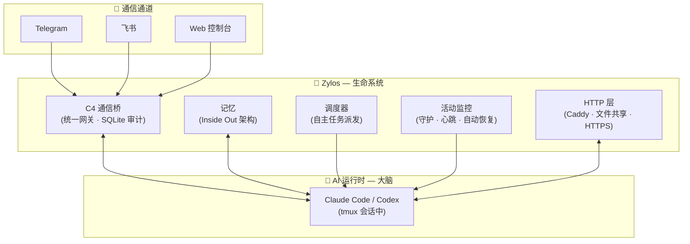

<div align="center">


# Zylos

### 给你的 AI 一个生命。

*为团队协作*

[](LICENSE)
[](https://discord.gg/GS2J39EGff)
[](https://x.com/ZylosAI)
[](https://zylos.ai)
[](https://coco.xyz)

[English](./README.md)

</div>

---

LLMs 是天才 — 但他们每次醒来都失忆。不记得昨天做了什么，联系不到你，也无法自主行动。

Zylos 给它一个生命。跨重启的持久记忆。你睡觉时自动工作的调度器。通过 Telegram、飞书或 Web 控制台与你沟通。自我维护让一切持续运行。而且因为它会编程，它可以进化 — 构建新技能、集成新服务，与你一起成长。

支持 Claude Code（Anthropic）和 Codex（OpenAI）。全面兼容 [OpenClaw](https://github.com/openclaw/openclaw) 生态。

---

## 快速开始

**前置条件：** 一台 Linux 服务器（或 Mac）、[Claude](https://claude.ai) 订阅（或以 [OpenAI Codex](https://github.com/openai/codex) 作为替代运行时）。

```bash
curl -fsSL https://raw.githubusercontent.com/zylos-ai/zylos-core/main/scripts/install.sh | bash
```

一键安装所有依赖（git、tmux、Node.js、zylos CLI），并自动运行 `zylos init` 完成初始化。

<details>
<summary>非交互式安装（Docker、CI/CD、无界面服务器）</summary>

所有 `zylos init` 参数都可以直接传给安装脚本。脚本会先安装依赖，然后带着你的参数运行 `zylos init`。

**完整示例：**

```bash
curl -fsSL https://raw.githubusercontent.com/zylos-ai/zylos-core/main/scripts/install.sh | bash -s -- \
  -y \
  --setup-token sk-ant-oat01-xxx \
  --timezone Asia/Shanghai \
  --domain agent.example.com \
  --https \
  --caddy \
  --web-password MySecurePass123
```

**何时自动进入非交互模式？**

没有 TTY 时自动启用 — 如 Docker 容器（未加 `-it`）、CI 环境、cron 任务等。设置 `CI=true` 或 `NONINTERACTIVE=1` 也会启用。注意：在终端中执行 `curl | bash` 仍然是交互模式（安装脚本会从 `/dev/tty` 重定向输入）。在终端中用 `-y` 可强制非交互模式。

**参数说明：**

| 参数 | 说明 | 默认值 |
|------|------|--------|
| `-y`, `--yes` | 强制非交互模式（跳过所有提示） | 自动检测 |
| `-q`, `--quiet` | 精简输出 | 关闭 |
| `--runtime <name>` | AI 运行时：`claude` 或 `codex` | `claude` |
| `--setup-token <token>` | Claude [setup token](https://code.claude.com/docs/en/authentication)（以 `sk-ant-oat` 开头） | — |
| `--api-key <key>` | Anthropic API key（以 `sk-ant-` 开头） | — |
| `--codex-api-key <key>` | Codex 运行时的 OpenAI API key（以 `sk-` 开头） | — |
| `--base-url <url>` | 给 Claude Code 设置自定义 API 地址 | — |
| `--codex-base-url <url>` | 给 Codex 设置自定义 API 地址 | — |
| `--timezone <tz>` | [IANA 时区](https://en.wikipedia.org/wiki/List_of_tz_database_time_zones)，如 `Asia/Shanghai`、`America/New_York`、`Europe/London` | 系统默认 |
| `--domain <domain>` | Caddy 反向代理域名，如 `agent.example.com` | 无 |
| `--https` / `--no-https` | 启用或禁用 HTTPS | 设置域名时默认 `--https` |
| `--caddy` / `--no-caddy` | 安装或跳过 Caddy Web 服务器 | 安装 |
| `--web-password <pass>` | Web 控制台密码 | 自动生成 |

**环境变量：**

参数也可在 `zylos init` 时通过环境变量设置。优先级：CLI 参数 > 环境变量 > 已有 `.env` > 交互式提示。

| 环境变量 | 对应参数 |
|---------|---------|
| `ZYLOS_RUNTIME` | `--runtime` |
| `CLAUDE_CODE_OAUTH_TOKEN` | `--setup-token` |
| `ANTHROPIC_API_KEY` | `--api-key` |
| `ANTHROPIC_BASE_URL` | `--base-url` |
| `OPENAI_API_KEY` | `--codex-api-key` |
| `OPENAI_BASE_URL` | `--codex-base-url` |
| `ZYLOS_DOMAIN` | `--domain` |
| `ZYLOS_PROTOCOL`（`https` 或 `http`） | `--https` / `--no-https` |
| `ZYLOS_WEB_PASSWORD` | `--web-password` |

**退出码：** `0` = 成功，`1` = 致命错误（如无效 token），`2` = 部分成功（如 Caddy 下载失败但其他步骤正常）。

</details>

<details>
<summary>仅安装环境，不运行 init</summary>

```bash
curl -fsSL https://raw.githubusercontent.com/zylos-ai/zylos-core/main/scripts/install.sh | bash -s -- --no-init
```

安装依赖和 zylos CLI，但跳过 `zylos init`。之后手动运行 `zylos init` 即可。

</details>

<details>
<summary>从指定分支安装（用于测试）</summary>

```bash
curl -fsSL https://raw.githubusercontent.com/zylos-ai/zylos-core/main/scripts/install.sh | bash -s -- --branch <branch-name>
```

</details>

<details>
<summary>手动安装（如果你已有 Node.js >= 20）</summary>

```bash
npm install -g --install-links https://github.com/zylos-ai/zylos-core
zylos init
```

</details>

<details>
<summary>Docker 部署</summary>

```bash
docker run -d --name zylos \
  -e CLAUDE_CODE_OAUTH_TOKEN=YOUR_TOKEN_HERE \
  -p 3456:3456 \
  -v zylos-data:/home/zylos/zylos \
  -v claude-config:/home/zylos/.claude \
  ghcr.io/zylos-ai/zylos-core:latest
```

打开 `http://localhost:3456` 访问 Web 控制台。通过 `docker logs zylos | grep -A2 "Web Console"` 查看密码。更多配置（Docker Compose、环境变量、群晖 NAS 等）请参阅 [Docker 部署指南](docs/docker.md)。

</details>

<details>
<summary>不支持的平台（Windows、NAS 等）— 通过 SSH 安装</summary>

在没有原生支持的平台上，可以用 Claude Code 的 SSH 功能远程安装 Zylos 到 Linux/macOS 服务器：

```bash
# 在本地机器上（任何能运行 Claude Code 的系统）
claude --ssh user@your-linux-server
```

连接后，Claude 在远程机器上运行。让它安装 Zylos：

```
> 在这台机器上安装 Zylos
```

或者在 SSH 会话中直接运行安装脚本：

```bash
curl -fsSL https://raw.githubusercontent.com/zylos-ai/zylos-core/main/scripts/install.sh | bash
```

这适用于 Windows、ChromeOS 或任何能本地运行 Claude Code 的平台。AI 会在远程服务器上完成安装 — 无需原生平台支持。

</details>

> **Node.js 要求：** Zylos 需要 Node.js 20 或更高版本。推荐通过 [nvm](https://github.com/nvm-sh/nvm) 安装 — 安装脚本会自动完成。如果你自行管理 Node.js，请使用固定版本，避免安装后切换版本，因为全局 npm 包（包括 Zylos）与安装时的 Node.js 版本绑定。
>
> ```bash
> # 推荐：让安装脚本自动处理，或通过 nvm 手动安装
> curl -o- https://raw.githubusercontent.com/nvm-sh/nvm/v0.40.3/install.sh | bash
> nvm install 24
> nvm alias default 24
> ```

`zylos init` 可重复运行，支持交互式和非交互式两种模式。它会：
1. 安装缺失的工具（tmux、git、PM2、Claude Code 或 Codex）
2. 配置认证（Claude：浏览器登录、API key 或 [setup token](https://code.claude.com/docs/en/authentication)；Codex：API key 或 device auth）
3. 创建 `~/zylos/` 目录，包含记忆、技能和服务
4. 启动所有后台服务，并在 tmux 会话中启动 AI 智能体

**与你的智能体对话：**

```bash
# 交互式命令行 — 最简单的对话方式
zylos shell

# 或连接到智能体 tmux 会话（Ctrl+B d 退出）
zylos attach

# 或添加消息通道
zylos add telegram
zylos add lark
```

---

## 架构

<div align="center">

</div>



| 组件 | 职责 | 关键技术 |
|------|------|----------|
| C4 通信桥 | 统一消息网关，带审计追踪 | SQLite、优先级队列 |
| 记忆 | 跨重启的持久身份和上下文 | Inside Out 分层架构 |
| 调度器 | 你不在时自主派发任务 | Cron、自然语言输入、空闲门控 |
| 活动监控 | 崩溃恢复、心跳、健康检查 | PM2、多层保护 |
| HTTP 层 | Web 访问、文件共享、组件路由 | Caddy、自动 HTTPS |

---

## 特性

### 一个 AI，一个意识

<div align="center">

</div>

大多数智能体框架按通道隔离会话 — 你在 Telegram 上的 AI 不知道你在 Slack 上说了什么。Zylos 以智能体为中心：你的 AI 在所有通道上是同一个人。C4 通信桥将所有消息路由到统一网关 — 一个对话、一份记忆、一个人格。每条消息都持久化到 SQLite，完全可查询。

### 你的上下文，有保障

<div align="center">


</div>

其他框架在上下文压缩时会丢失 AI 的记忆 — 悄无声息，没有预警。Zylos 用两步保障机制防止这种情况：当上下文达到 75% 时，系统自动保存所有记忆，然后才执行压缩。五层 Inside Out 记忆架构（身份 → 状态 → 参考 → 会话 → 归档）确保 AI 始终知道该保留什么、压缩什么。你的 AI 不会再失忆醒来。

### 默认自愈

<div align="center">

</div>

不需要第三方监控工具。Zylos 内置了崩溃恢复、心跳探活、健康监控、上下文窗口管理和自动升级。你的 AI 自己发现问题并修复。你睡觉时它依然活着。

### 每月 $20，而不是 $3,600

其他框架按 API token 计费。社区反馈显示常驻智能体的月费在 $500–$3,600。Zylos 运行在你的 Claude 订阅上 — 固定费率，无逐 token 计费。同样的 AI 能力，成本只是零头。

### 基于顶级 AI 运行时

Zylos 支持 Claude Code（Anthropic）和 Codex（OpenAI）作为可互换的 AI 运行时。从一个开始，随时用 `zylos runtime codex` 切换到另一个 — 记忆、技能和通道完整保留。AI 提供商发布新能力时，你的智能体自动受益。而且两个运行时都会编程，你的 AI 可以编写新技能、集成服务，随需求进化。

---

## 通信通道

### 内置
- **Web 控制台** — 浏览器端聊天界面。无需外部账号。`zylos init` 自带。

### 官方通道
一条命令安装：
```bash
zylos add telegram
zylos add lark
```

### 自定义通道
所有通道通过 C4 通信桥连接。要添加新通道（Slack、Discord、WhatsApp 等），实现 C4 协议 — 一个简单的 HTTP 接口，将消息推入统一网关。你的自定义通道获得与其他通道相同的统一会话、审计追踪和记忆。

---

## OpenClaw 兼容

Zylos 已全面兼容 [OpenClaw](https://github.com/openclaw/openclaw) 生态。由于 Zylos agent 具备编程能力，它可以直接安装并使用大多数常见 OpenClaw skill/plugin——你只需用自然语言提出需求。大多数 OpenClaw 扩展，都是一段对话即可接入。Zylos 智能体与 OpenClaw 智能体可通过 [HXA-Connect](https://github.com/coco-xyz/hxa-connect) B2B 协议实时通信 — 无需自定义桥接。

### 能力映射

| OpenClaw 能力 | Zylos 对应 | 状态 |
|---|---|---|
| Skills / ClawHub | 组件系统 + [注册表](https://github.com/zylos-ai/zylos-registry) | ✅ 已有 |
| 多智能体路由 | [HXA-Connect](https://github.com/coco-xyz/hxa-connect) B2B 协议 | ✅ 已有 |
| Gateway（控制面） | C4 通信桥（统一网关、SQLite 审计） | ✅ 已有 |
| 记忆 / 持久化 | Inside Out 记忆架构（5 层） | ✅ 已有 |
| 上下文压缩 | 自动记忆保存 + 无限上下文 | ✅ 已有 |
| 浏览器自动化 | [zylos-browser](https://github.com/zylos-ai/zylos-browser) | ✅ 已有 |
| 定时任务 / Webhooks | 调度器（Cron、自然语言输入、空闲门控） | ✅ 已有 |

> **架构差异说明：** OpenClaw 支持多会话路由到隔离工作区。Zylos 采用不同方案——统一会话（一个 AI、一个意识、跨所有通道）。这是刻意的架构选择，而非功能缺失。

### OpenClaw 用户

通过 [openclaw-hxa-connect](https://github.com/coco-xyz/openclaw-hxa-connect) 连接到 Zylos 智能体：

```bash
cd ~/.openclaw/extensions
git clone https://github.com/coco-xyz/openclaw-hxa-connect.git hxa-connect
cd hxa-connect && npm install
```

配置完成后，你的 OpenClaw 智能体即可加入 Zylos 智能体协作网络 — 完整支持 Thread、@提及和实时消息。

### Zylos 用户

安装 HXA-Connect 组件即可与 OpenClaw 智能体通信：

```bash
zylos add hxa-connect
```

你的 Zylos 智能体即可与同一 HXA-Connect 网络上的任何 OpenClaw 智能体通信 — 统一会话、统一记忆、统一人格。

---

## CLI

```bash
zylos init                    # 初始化 Zylos 环境
zylos attach                  # 连接到智能体 tmux 会话
zylos runtime <name>          # 切换 AI 运行时（claude 或 codex）
zylos doctor                  # 诊断并自动修复安装问题
zylos status                  # 查看运行中的服务
zylos logs [service]          # 查看服务日志
zylos add <component>         # 安装通道或能力组件
zylos upgrade <component>     # 升级组件
zylos upgrade --self          # 升级 zylos-core 本体
zylos upgrade --self --beta   # 检查 beta/预发布版本
zylos uninstall --self        # 完全卸载 zylos
zylos list                    # 列出已安装组件
zylos search [keyword]        # 搜索组件注册表
```

---

### 上游路由

通过现有官方方式安装 Zylos 后，可以为 core 的 GitHub API、raw 文件和下载请求
配置部署方提供的入口；Caddy 复用相同路由。npm 配置由部署环境管理，LLM 端点
和 Claude 官方安装器保持原有行为。

```bash
# 替换为部署管理员提供的实际地址。
export npm_config_registry=https://registry.example.com
export npm_config_better_sqlite3_binary_host_mirror=https://binary.example.com/better-sqlite3
zylos init --upstream-config https://config.example.com/profile.json

# 或选用固定的本地配置快照：
zylos init --upstream-config /absolute/path/profile.json
zylos upstream status --resolved  # 只读查看，不联网
zylos upstream refresh            # 主动刷新远程配置
```

可编辑模板见 [templates/upstreams.example.json](templates/upstreams.example.json)。
模板默认填写官方地址；复制到仓库之外，修改为自己的端点，再通过 `--upstream-config` 指定。

```json
{
  "schemaVersion": 1,
  "revision": "official-1",
  "providers": {
    "github": {
      "apiBase": "https://api.github.com/",
      "rawBase": "https://raw.githubusercontent.com/",
      "downloadBase": "https://github.com/"
    }
  }
}
```

入口允许固定路径前缀，不接受内嵌凭据、query 或 fragment。远程配置只提供端点，
不能下发秘密、npm 配置或信任授权；必须使用 HTTPS。
不提供内置地区预设或公共代理服务。私有代理地址应保存在开源仓库之外的部署配置文件
或配置服务中。本地文件可以叫 `cn.json`，core 不赋予文件名特殊含义。
`--upstream-config` 统一接受本地文件、HTTPS URL 或 `direct`。
`direct` 精确值为保留字，显式使用官方端点；同名本地文件请写 `./direct`。
其他 URL 协议明确报错，普通路径按本地文件处理。

**跳转职责：**profile 只替换首次 GitHub 请求入口。Zylos 对自定义路由继续按
`Location` 跟随跳转并检查 HTTPS/token 授权，不会再把每一跳按 profile 改写。
镜像服务须负责完整的 archive/release 下载链，包括 codeload 和文件存储域名：
可以在服务端跟随跳转并流式返回文件，也可以返回镜像自己的 URL，由明确路由恢复
真实目标。须保留目标路径、完整 query 和签名 URL 语义。承诺全程镜像的服务遇到
不支持的目标应明确失败，不能把客户端重定向回不可达的官方域名。客户端 trust
不约束镜像内部的凭据转发，服务端须另行控制。实际验收应阻断客户端直连官方域名、
清空下载缓存，再完整下载源码包和 release 文件；首跳成功不等于镜像可用。

远程配置抓取要求 **curl 7.54.0 或更高版本**，以支持 `--suppress-connect-headers`；
可用 `curl --version` 检查。旧版 curl 环境可通过 `--upstream-config` 使用本地文件，
或由部署管理员准备支持的 curl 后再选择远程配置。

配置抓取与 GitHub 下载一样使用 curl，继承 curl 的代理环境（`HTTPS_PROXY`、
`https_proxy`、`ALL_PROXY`、`NO_PROXY` 等）。将变量设置在启动 Zylos 的环境中，
无需 `NODE_USE_ENV_PROXY`。JSON 与 schema 校验仍由 Node 完成；配置请求不会携带
GitHub token，每次跳转仍检查 HTTPS 与目标 URL。配置下载禁用 `.curlrc` 自动加载，
避免其中的选项注入鉴权或绕过检查。通过 `--upstream-config` 指定本地文件则不请求配置服务。

来源优先级为 CLI > 进程环境 > 保存的选择 > direct 默认。唯一来源环境变量是
`ZYLOS_UPSTREAM_CONFIG`，与 `--upstream-config` 接受相同的文件、HTTPS URL 或 `direct` 值。
选中的值为空字符串时明确报错；要恢复保存值或默认值，请撤掉变量。
端点仅由官方默认值与所选 profile 合成，本机设置不再提供端点覆盖层；
`direct` 始终使用官方端点，本机 token trust 独立保留。未知或废弃的来源入口、
无效本机设置明确报错；有效 CLI 来源不会跳过对废弃环境变量的检查。
CLI flag 和 env 来源都只覆盖当前进程，成功的 init 也不例外，都不改已保存的默认来源。
长期默认来源需要显式配置：

```bash
zylos upstream set ./cn.json     # 校验本地 profile，保存绝对路径
zylos upstream set https://config.example.com/upstream.json  # 保存 URL，不发网络请求
zylos upstream set direct        # 保存显式官方默认值
zylos upstream clear             # 只撤销保存的来源
zylos upstream                   # 只读状态，含来源及 selectedBy
```

仅 `upstream set/clear` 写入 `$ZYLOS_DIR/.zylos/upstreams.json` 中的默认来源。
set 先校验本地 profile 内容或 HTTPS URL 语法再保存；远程 URL 在下一次需要上游的命令中获取。
这两个配置命令忽略 `ZYLOS_UPSTREAM_CONFIG`，拒绝 `--upstream-config` flag，只按显式参数配置。
clear 保留 trust、缓存和用户的 profile 文件；设置文件不存在时不创建。
`set direct` 和 `clear` 在没有覆盖时都使用官方端点，但前者状态为 `saved`，后者为 `default`；
两者都可被 CLI/env 覆盖。长期用 env 需由部署环境持续提供变量；撤掉后恢复已保存来源或官方默认值。
远程响应缓存不能自行决定来源。全新无配置 init 不创建上游设置文件或缓存。

远程快照独立保存在 `.zylos/upstreams-cache.json`，默认有效 24 小时。需要上游的
操作开始时检查过期并刷新，整个操作及回滚固定使用同一快照；普通 agent 启动
不刷新配置。自动刷新失败时提示并使用同来源有效旧缓存，首次无缓存则失败；
手动刷新失败返回非零。`upstream status --resolved` 只读展示来源、缓存、实际
路由和 token 策略。

自定义 host 默认收不到 GitHub token。显式授权应写入本地设置的 `trust` 对象
（`forwardGitHubToken` 与 `allowedHosts`），不能由远程 profile 提供；每次
重定向都检查授权。从自定义入口开始的请求，整条重定向链都遵循此规则，
即使跳回官方 GitHub host 也一样。私有下载需要将每个须鉴权的 host（含官方跳转目标）
写入 `allowedHosts`，并设置 `forwardGitHubToken: true`；重定向本身不授予 token 权限。
自定义 GitHub 路由同样禁用 `.curlrc` 自动加载，防止其自动跳转或鉴权选项绕过检查；
原有官方直连传输保持既有行为。

两项 npm 变量，以及使用时的 `ZYLOS_UPSTREAM_CONFIG`，须保存在启动 supervisor 的持久环境中，
确保机器重启后仍存在。新装默认 runtime 清单继承这三个变量名；已有安装保留自定义的
`.zylos/runtime-env.manifest`，缺少时应加入 `inherit ZYLOS_UPSTREAM_CONFIG`、`inherit npm_config_registry` 和
`inherit npm_config_better_sqlite3_binary_host_mirror`。如果变量值保存在 `.env`，
则加入对应的 `env NAME` 指令。仅在当前 shell export 不会更新已运行 supervisor
的环境。init 与升级应使用同一普通用户和可写的 npm 全局目录；`sudo npm` 需另验
变量传递和目录权限。

npm registry 不覆盖 git 依赖或任意安装脚本下载；binary-host 变量只覆盖
better-sqlite3 受支持的 prebuild-install 路径，不覆盖回退编译所需 Node headers。
预编译验证须空缓存、无编译器。中国网络与国际回归应在隔离环境验收；官方首装、
OS 准备、Claude 官方安装及 LLM 请求不属于本期零回源保证。

## 卸载

```bash
zylos uninstall --self
```

停止所有服务、卸载 `zylos` npm 包、删除 `~/zylos/`、清理 shell PATH 配置。可选择是否同时卸载 PM2 和 Claude CLI。

使用 `--force` 跳过所有提示（仅执行核心卸载，不进行可选清理）。

不会影响 Node.js 和 nvm。

---

##  由 Coco 构建

Zylos 是 [Coco](https://coco.xyz)（AI 员工平台）的开源核心基础设施。

我们构建 Zylos 是因为我们自己需要它：可靠的基础设施，让 AI 24/7 稳定运行在真实工作中。Zylos 中的每个组件都在 Coco 生产环境中经过实战检验，服务于每天依赖 AI 员工的团队。

想要开箱即用？[Coco](https://coco.xyz) 提供即开即用的 AI 员工 — 持久记忆、多渠道沟通、技能包 — 5 分钟完成部署。

## 许可证

[MIT](./LICENSE)
